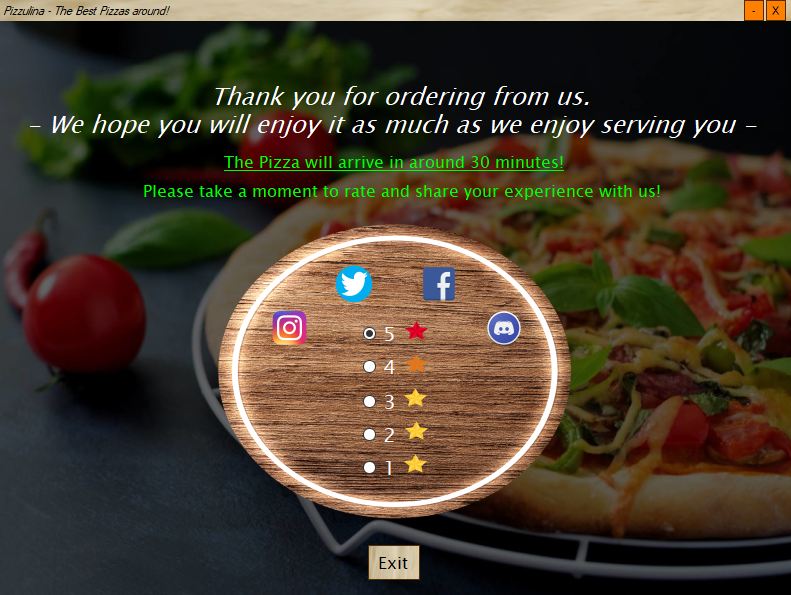

# Pizzulina

Pizza ordering desktop app 

- Created using C# in Visual Studio

- Fully working login system that saves login info between sessions

- Settings menu

- Order as much pizza as you want

- You can create your own pizza 

- Special promotions are applied to your order

- Option to pay with a credit card or with cash at delivery

- Share your new order on different social platforms such as Instagram, Twitter, Facebook or Discord

[Login]

[Promotions]

[Create your pizza]

[Choose some already premade pizza]

[Order complete]

Disclaimer: no pizzas will be ordered through this app, it is just a mockup :)
